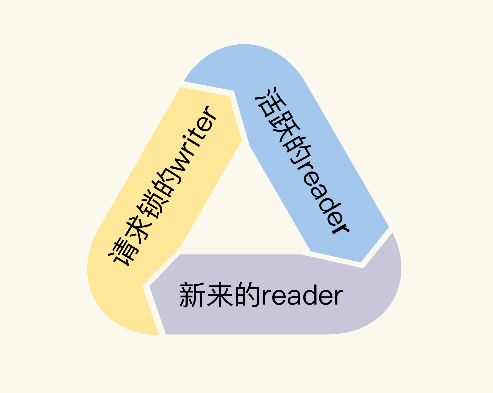
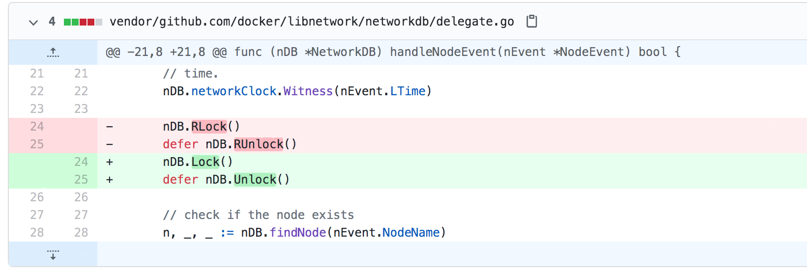
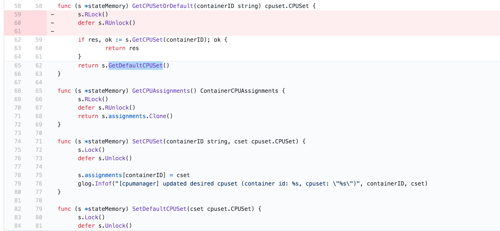

# 05｜ RWMutex：读写锁的实现原理及避坑指南
你好，我是鸟窝。

在前面的四节课中，我们学习了第一个同步原语，即Mutex，我们使用它来保证读写共享资源的安全性。不管是读还是写，我们都通过Mutex来保证只有一个goroutine访问共享资源，这在某些情况下有点“浪费”。比如说，在写少读多的情况下，即使一段时间内没有写操作，大量并发的读访问也不得不在Mutex的保护下变成了串行访问，这个时候，使用Mutex，对性能的影响就比较大。

怎么办呢？你是不是已经有思路了，对，就是区分读写操作。

我来具体解释一下。如果某个读操作的goroutine持有了锁，在这种情况下，其它读操作的goroutine就不必一直傻傻地等待了，而是可以并发地访问共享变量，这样我们就可以 **将串行的读变成并行读**，提高读操作的性能。当写操作的goroutine持有锁的时候，它就是一个排外锁，其它的写操作和读操作的goroutine，需要阻塞等待持有这个锁的goroutine释放锁。

这一类并发读写问题叫作 [readers-writers问题](https://en.wikipedia.org/wiki/Readers%E2%80%93writers_problem)，意思就是，同时可能有多个读或者多个写，但是只要有一个线程在执行写操作，其它的线程都不能执行读写操作。

**Go标准库中的RWMutex（读写锁）就是用来解决这类readers-writers问题的**。所以，这节课，我们就一起来学习RWMutex。我会给你介绍读写锁的使用场景、实现原理以及容易掉入的坑，你一定要记住这些陷阱，避免在实际的开发中犯相同的错误。

# 什么是RWMutex？

我先简单解释一下读写锁RWMutex。标准库中的RWMutex是一个 reader/writer 互斥锁。RWMutex在某一时刻只能由任意数量的reader持有，或者是只被单个的writer持有。

RWMutex的方法也很少，总共有5个。

- **Lock/Unlock：写操作时调用的方法**。如果锁已经被reader或者writer持有，那么，Lock方法会一直阻塞，直到能获取到锁；Unlock则是配对的释放锁的方法。
- **RLock/RUnlock：读操作时调用的方法**。如果锁已经被writer持有的话，RLock方法会一直阻塞，直到能获取到锁，否则就直接返回；而RUnlock是reader释放锁的方法。
- **RLocker**：这个方法的作用是为读操作返回一个Locker接口的对象。它的Lock方法会调用RWMutex的RLock方法，它的Unlock方法会调用RWMutex的RUnlock方法。

RWMutex的零值是未加锁的状态，所以，当你使用RWMutex的时候，无论是声明变量，还是嵌入到其它struct中，都不必显式地初始化。

我以计数器为例，来说明一下，如何使用RWMutex保护共享资源。计数器的 **count++操作是写** 操作，而获取count的值是 **读** 操作，这个场景非常适合读写锁，因为读操作可以并行执行，写操作时只允许一个线程执行，这正是readers-writers问题。

在这个例子中，使用10个goroutine进行读操作，每读取一次，sleep 1毫秒，同时，还有一个gorotine进行写操作，每一秒写一次，这是一个 **1** writer- **n** reader 的读写场景，而且写操作还不是很频繁（一秒一次）：

```
func main() {
    var counter Counter
    for i := 0; i < 10; i++ { // 10个reader
        go func() {
            for {
                counter.Count() // 计数器读操作
                time.Sleep(time.Millisecond)
            }
        }()
    }

    for { // 一个writer
        counter.Incr() // 计数器写操作
        time.Sleep(time.Second)
    }
}
// 一个线程安全的计数器
type Counter struct {
    mu    sync.RWMutex
    count uint64
}

// 使用写锁保护
func (c *Counter) Incr() {
    c.mu.Lock()
    c.count++
    c.mu.Unlock()
}

// 使用读锁保护
func (c *Counter) Count() uint64 {
    c.mu.RLock()
    defer c.mu.RUnlock()
    return c.count
}

```

可以看到，Incr方法会修改计数器的值，是一个写操作，我们使用Lock/Unlock进行保护。Count方法会读取当前计数器的值，是一个读操作，我们使用RLock/RUnlock方法进行保护。

Incr方法每秒才调用一次，所以，writer竞争锁的频次是比较低的，而10个goroutine每毫秒都要执行一次查询，通过读写锁，可以极大提升计数器的性能，因为在读取的时候，可以并发进行。如果使用Mutex，性能就不会像读写锁这么好。因为多个reader并发读的时候，使用互斥锁导致了reader要排队读的情况，没有RWMutex并发读的性能好。

**如果你遇到可以明确区分reader和writer goroutine的场景，且有大量的并发读、少量的并发写，并且有强烈的性能需求，你就可以考虑使用读写锁RWMutex替换Mutex。**

在实际使用RWMutex的时候，如果我们在struct中使用RWMutex保护某个字段，一般会把它和这个字段放在一起，用来指示两个字段是一组字段。除此之外，我们还可以采用匿名字段的方式嵌入struct，这样，在使用这个struct时，我们就可以直接调用Lock/Unlock、RLock/RUnlock方法了，这和我们前面在 [01讲](https://time.geekbang.org/column/article/294905) 中介绍Mutex的使用方法很类似，你可以回去复习一下。

# RWMutex的实现原理

RWMutex是很常见的并发原语，很多编程语言的库都提供了类似的并发类型。RWMutex一般都是基于互斥锁、条件变量（condition variables）或者信号量（semaphores）等并发原语来实现。 **Go标准库中的RWMutex是基于Mutex实现的。**

readers-writers问题一般有三类，基于对读和写操作的优先级，读写锁的设计和实现也分成三类。

- **Read-preferring**：读优先的设计可以提供很高的并发性，但是，在竞争激烈的情况下可能会导致写饥饿。这是因为，如果有大量的读，这种设计会导致只有所有的读都释放了锁之后，写才可能获取到锁。
- **Write-preferring**：写优先的设计意味着，如果已经有一个writer在等待请求锁的话，它会阻止新来的请求锁的reader获取到锁，所以优先保障writer。当然，如果有一些reader已经请求了锁的话，新请求的writer也会等待已经存在的reader都释放锁之后才能获取。所以，写优先级设计中的优先权是针对新来的请求而言的。这种设计主要避免了writer的饥饿问题。
- **不指定优先级**：这种设计比较简单，不区分reader和writer优先级，某些场景下这种不指定优先级的设计反而更有效，因为第一类优先级会导致写饥饿，第二类优先级可能会导致读饥饿，这种不指定优先级的访问不再区分读写，大家都是同一个优先级，解决了饥饿的问题。

**Go标准库中的RWMutex设计是Write-preferring方案。一个正在阻塞的Lock调用会排除新的reader请求到锁。**

RWMutex包含一个Mutex，以及四个辅助字段writerSem、readerSem、readerCount和readerWait：

```
type RWMutex struct {
	w           Mutex   // 互斥锁解决多个writer的竞争
	writerSem   uint32  // writer信号量
	readerSem   uint32  // reader信号量
	readerCount int32   // reader的数量
	readerWait  int32   // writer等待完成的reader的数量
}

const rwmutexMaxReaders = 1 << 30

```

我来简单解释一下这几个字段。

- 字段w：为writer的竞争锁而设计；
- 字段readerCount：记录当前reader的数量（以及是否有writer竞争锁）；
- readerWait：记录writer请求锁时需要等待read完成的reader的数量；
- writerSem 和readerSem：都是为了阻塞设计的信号量。

这里的常量rwmutexMaxReaders，定义了最大的reader数量。

好了，知道了RWMutex的设计方案和具体字段，下面我来解释一下具体的方法实现。

## RLock/RUnlock的实现

首先，我们看一下移除了race等无关紧要的代码后的RLock和RUnlock方法：

```
func (rw *RWMutex) RLock() {
    if atomic.AddInt32(&rw.readerCount, 1) < 0 {
            // rw.readerCount是负值的时候，意味着此时有writer等待请求锁，因为writer优先级高，所以把后来的reader阻塞休眠
        runtime_SemacquireMutex(&rw.readerSem, false, 0)
    }
}
func (rw *RWMutex) RUnlock() {
    if r := atomic.AddInt32(&rw.readerCount, -1); r < 0 {
        rw.rUnlockSlow(r) // 有等待的writer
    }
}
func (rw *RWMutex) rUnlockSlow(r int32) {
    if atomic.AddInt32(&rw.readerWait, -1) == 0 {
        // 最后一个reader了，writer终于有机会获得锁了
        runtime_Semrelease(&rw.writerSem, false, 1)
    }
}

```

第2行是对reader计数加1。你可能比较困惑的是，readerCount怎么还可能为负数呢？其实，这是因为，readerCount这个字段有双重含义：

- 没有writer竞争或持有锁时，readerCount和我们正常理解的reader的计数是一样的；
- 但是，如果有writer竞争锁或者持有锁时，那么，readerCount不仅仅承担着reader的计数功能，还能够标识当前是否有writer竞争或持有锁，在这种情况下，请求锁的reader的处理进入第4行，阻塞等待锁的释放。

调用RUnlock的时候，我们需要将Reader的计数减去1（第8行），因为reader的数量减少了一个。但是，第8行的AddInt32的返回值还有另外一个含义。如果它是负值，就表示当前有writer竞争锁，在这种情况下，还会调用rUnlockSlow方法，检查是不是reader都释放读锁了，如果读锁都释放了，那么可以唤醒请求写锁的writer了。

当一个或者多个reader持有锁的时候，竞争锁的writer会等待这些reader释放完，才可能持有这把锁。打个比方，在房地产行业中有条规矩叫做“ **买卖不破租赁**”，意思是说，就算房东把房子卖了，新业主也不能把当前的租户赶走，而是要等到租约结束后，才能接管房子。这和RWMutex的设计是一样的。当writer请求锁的时候，是无法改变既有的reader持有锁的现实的，也不会强制这些reader释放锁，它的优先权只是限定后来的reader不要和它抢。

所以，rUnlockSlow将持有锁的reader计数减少1的时候，会检查既有的reader是不是都已经释放了锁，如果都释放了锁，就会唤醒writer，让writer持有锁。

## Lock

RWMutex是一个多writer多reader的读写锁，所以同时可能有多个writer和reader。那么，为了避免writer之间的竞争，RWMutex就会使用一个Mutex来保证writer的互斥。

一旦一个writer获得了内部的互斥锁，就会反转readerCount字段，把它从原来的正整数readerCount(>=0)修改为负数（readerCount-rwmutexMaxReaders），让这个字段保持两个含义（既保存了reader的数量，又表示当前有writer）。

我们来看下下面的代码。第5行，还会记录当前活跃的reader数量，所谓活跃的reader，就是指持有读锁还没有释放的那些reader。

```
func (rw *RWMutex) Lock() {
    // 首先解决其他writer竞争问题
    rw.w.Lock()
    // 反转readerCount，告诉reader有writer竞争锁
    r := atomic.AddInt32(&rw.readerCount, -rwmutexMaxReaders) + rwmutexMaxReaders
    // 如果当前有reader持有锁，那么需要等待
    if r != 0 && atomic.AddInt32(&rw.readerWait, r) != 0 {
        runtime_SemacquireMutex(&rw.writerSem, false, 0)
    }
}

```

如果readerCount不是0，就说明当前有持有读锁的reader，RWMutex需要把这个当前readerCount赋值给readerWait字段保存下来（第7行）， 同时，这个writer进入阻塞等待状态（第8行）。

每当一个reader释放读锁的时候（调用RUnlock方法时），readerWait字段就减1，直到所有的活跃的reader都释放了读锁，才会唤醒这个writer。

## Unlock

当一个writer释放锁的时候，它会再次反转readerCount字段。可以肯定的是，因为当前锁由writer持有，所以，readerCount字段是反转过的，并且减去了rwmutexMaxReaders这个常数，变成了负数。所以，这里的反转方法就是给它增加rwmutexMaxReaders这个常数值。

既然writer要释放锁了，那么就需要唤醒之后新来的reader，不必再阻塞它们了，让它们开开心心地继续执行就好了。

在RWMutex的Unlock返回之前，需要把内部的互斥锁释放。释放完毕后，其他的writer才可以继续竞争这把锁。

```
func (rw *RWMutex) Unlock() {
    // 告诉reader没有活跃的writer了
    r := atomic.AddInt32(&rw.readerCount, rwmutexMaxReaders)

    // 唤醒阻塞的reader们
    for i := 0; i < int(r); i++ {
        runtime_Semrelease(&rw.readerSem, false, 0)
    }
    // 释放内部的互斥锁
    rw.w.Unlock()
}

```

在这段代码中，我删除了race的处理和异常情况的检查，总体看来还是比较简单的。这里有几个重点，我要再提醒你一下。首先，你要理解readerCount这个字段的含义以及反转方式。其次，你还要注意字段的更改和内部互斥锁的顺序关系。在Lock方法中，是先获取内部互斥锁，才会修改的其他字段；而在Unlock方法中，是先修改的其他字段，才会释放内部互斥锁，这样才能保证字段的修改也受到互斥锁的保护。

好了，到这里我们就完整学习了RWMutex的概念和实现原理。RWMutex的应用场景非常明确，就是解决readers-writers问题。学完了今天的内容，之后当你遇到这类问题时，要优先想到RWMutex。另外，Go并发原语代码实现的质量都很高，非常精炼和高效，所以，你可以通过看它们的实现原理，学习一些编程的技巧。当然，还有非常重要的一点就是要知道reader或者writer请求锁的时候，既有的reader/writer和后续请求锁的reader/writer之间的（释放锁/请求锁）顺序关系。

有个很有意思的事儿，就是官方的文档对RWMutex介绍是错误的，或者说是 [不明确的](https://github.com/golang/go/issues/41555)，在下一个版本（Go 1.16）中，官方会更改对RWMutex的介绍，具体是这样的：

> A RWMutex is a reader/writer mutual exclusion lock.

> The lock can be held by any number of readers or a single writer, and

> a blocked writer also blocks new readers from acquiring the lock.

这个描述是相当精确的，它指出了RWMutex可以被谁持有，以及writer比后续的reader有获取锁的优先级。

虽然RWMutex暴露的API也很简单，使用起来也没有复杂的逻辑，但是和Mutex一样，在实际使用的时候，也会很容易踩到一些坑。接下来，我给你重点介绍3个常见的踩坑点。

# RWMutex的3个踩坑点

## 坑点1：不可复制

前面刚刚说过，RWMutex是由一个互斥锁和四个辅助字段组成的。我们很容易想到，互斥锁是不可复制的，再加上四个有状态的字段，RWMutex就更加不能复制使用了。

不能复制的原因和互斥锁一样。一旦读写锁被使用，它的字段就会记录它当前的一些状态。这个时候你去复制这把锁，就会把它的状态也给复制过来。但是，原来的锁在释放的时候，并不会修改你复制出来的这个读写锁，这就会导致复制出来的读写锁的状态不对，可能永远无法释放锁。

那该怎么办呢？其实，解决方案也和互斥锁一样。你可以借助vet工具，在变量赋值、函数传参、函数返回值、遍历数据、struct初始化等时，检查是否有读写锁隐式复制的情景。

## 坑点2：重入导致死锁

读写锁因为重入（或递归调用）导致死锁的情况更多。

我先介绍第一种情况。因为读写锁内部基于互斥锁实现对writer的并发访问，而互斥锁本身是有重入问题的，所以，writer重入调用Lock的时候，就会出现死锁的现象，这个问题，我们在学习互斥锁的时候已经了解过了。

```
func foo(l *sync.RWMutex) {
    fmt.Println("in foo")
    l.Lock()
    bar(l)
    l.Unlock()
}

func bar(l *sync.RWMutex) {
    l.Lock()
    fmt.Println("in bar")
    l.Unlock()
}

func main() {
    l := &sync.RWMutex{}
    foo(l)
}

```

运行这个程序，你就会得到死锁的错误输出，在Go运行的时候，很容易就能检测出来。

第二种死锁的场景有点隐蔽。我们知道，有活跃reader的时候，writer会等待，如果我们在reader的读操作时调用writer的写操作（它会调用Lock方法），那么，这个reader和writer就会形成互相依赖的死锁状态。Reader想等待writer完成后再释放锁，而writer需要这个reader释放锁之后，才能不阻塞地继续执行。这是一个读写锁常见的死锁场景。

第三种死锁的场景更加隐蔽。

当一个writer请求锁的时候，如果已经有一些活跃的reader，它会等待这些活跃的reader完成，才有可能获取到锁，但是，如果之后活跃的reader再依赖新的reader的话，这些新的reader就会等待writer释放锁之后才能继续执行，这就形成了一个环形依赖： **writer依赖活跃的reader -> 活跃的reader依赖新来的reader -> 新来的reader依赖writer**。



这个死锁相当隐蔽，原因在于它和RWMutex的设计和实现有关。啥意思呢？我们来看一个计算阶乘(n!)的例子：

```
func main() {
    var mu sync.RWMutex

    // writer,稍微等待，然后制造一个调用Lock的场景
    go func() {
        time.Sleep(200 * time.Millisecond)
        mu.Lock()
        fmt.Println("Lock")
        time.Sleep(100 * time.Millisecond)
        mu.Unlock()
        fmt.Println("Unlock")
    }()

    go func() {
        factorial(&mu, 10) // 计算10的阶乘, 10!
    }()

    select {}
}

// 递归调用计算阶乘
func factorial(m *sync.RWMutex, n int) int {
    if n < 1 { // 阶乘退出条件
        return 0
    }
    fmt.Println("RLock")
    m.RLock()
    defer func() {
        fmt.Println("RUnlock")
        m.RUnlock()
    }()
    time.Sleep(100 * time.Millisecond)
    return factorial(m, n-1) * n // 递归调用
}

```

factoria方法是一个递归计算阶乘的方法，我们用它来模拟reader。为了更容易地制造出死锁场景，我在这里加上了sleep的调用，延缓逻辑的执行。这个方法会调用读锁（第27行），在第33行递归地调用此方法，每次调用都会产生一次读锁的调用，所以可以不断地产生读锁的调用，而且必须等到新请求的读锁释放，这个读锁才能释放。

同时，我们使用另一个goroutine去调用Lock方法，来实现writer，这个writer会等待200毫秒后才会调用Lock，这样在调用Lock的时候，factoria方法还在执行中不断调用RLock。

这两个goroutine互相持有锁并等待，谁也不会退让一步，满足了“writer依赖活跃的reader -> 活跃的reader依赖新来的reader -> 新来的reader依赖writer”的死锁条件，所以就导致了死锁的产生。

所以，使用读写锁最需要注意的一点就是尽量避免重入，重入带来的死锁非常隐蔽，而且难以诊断。

## 坑点3：释放未加锁的RWMutex

和互斥锁一样，Lock和Unlock的调用总是成对出现的，RLock和RUnlock的调用也必须成对出现。Lock和RLock多余的调用会导致锁没有被释放，可能会出现死锁，而Unlock和RUnlock多余的调用会导致panic。在生产环境中出现panic是大忌，你总不希望半夜爬起来处理生产环境程序崩溃的问题吧？所以，在使用读写锁的时候，一定要注意， **不遗漏不多余**。

# 流行的Go开发项目中的坑

好了，又到了泡一杯宁夏枸杞加新疆大滩枣的养生茶，静静地欣赏知名项目出现Bug的时候了，这次被拉出来的是RWMutex的Bug。

## Docker

### issue 36840

[issue 36840](https://github.com/moby/moby/pull/36840/files) 修复的是错误地把writer当成reader的Bug。 这个地方本来需要修改数据，需要调用的是写锁，结果用的却是读锁。或许是被它紧挨着的findNode方法调用迷惑了，认为这只是一个读操作。可实际上，代码后面还会有changeNodeState方法的调用，这是一个写操作。修复办法也很简单，只需要改成Lock/Unlock即可。



## Kubernetes

### issue 62464

[issue 62464](https://github.com/kubernetes/kubernetes/pull/62464) 就是读写锁第二种死锁的场景，这是一个典型的reader导致的死锁的例子。知道墨菲定律吧？“凡是可能出错的事，必定会出错”。你可能觉得我前面讲的RWMutex的坑绝对不会被人踩的，因为道理大家都懂，但是你看，Kubernetes就踩了这个重入的坑。

这个issue在移除pod的时候可能会发生，原因就在于，GetCPUSetOrDefault方法会请求读锁，同时，它还会调用GetCPUSet或GetDefaultCPUSet方法，这时又会请求读锁。如果期间有其它goroutine请求写锁的话，GetCPUSetOrDefault方法调用GetCPUSet或GetDefaultCPUSet方法时就不会返回了，请求写锁的goroutine也不会返回，这就会形成死锁。



# 总结

在开发过程中，一开始考虑共享资源并发访问问题的时候，我们就会想到互斥锁Mutex。因为刚开始的时候，我们还并不太了解并发的情况，所以，就会使用最简单的同步原语来解决问题。等到系统成熟，真正到了需要性能优化的时候，我们就能静下心来分析并发场景的可能性，这个时候，我们就要考虑将Mutex修改为RWMutex，来压榨系统的性能。

当然，如果一开始你的场景就非常明确了，比如我就要实现一个线程安全的map，那么，一开始你就可以考虑使用读写锁。

正如我在前面提到的，如果你能意识到你要解决的问题是一个readers-writers问题，那么你就可以毫不犹豫地选择RWMutex，不用考虑其它选择。那在使用RWMutex时，最需要注意的一点就是尽量避免重入，重入带来的死锁非常隐蔽，而且难以诊断。

另外我们也可以扩展RWMutex，不过实现方法和互斥锁Mutex差不多，在技术上是一样的，都是通过unsafe来实现，我就不再具体讲了。课下你可以参照我们 [上节课](https://time.geekbang.org/column/article/296793) 学习的方法，实现一个扩展的RWMutex。

这一讲我们系统学习了读写锁的相关知识，这里提供给你一个知识地图，帮助你复习本节课的知识。


# 思考题

请你写一个扩展的读写锁，比如提供TryLock，查询当前是否有writer、reader的数量等方法。

欢迎在留言区写下你的思考和答案，我们一起交流讨论。如果你觉得有所收获，也欢迎你把今天的内容分享给你的朋友或同事。